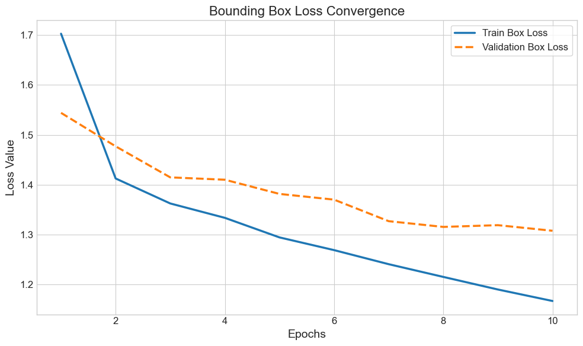
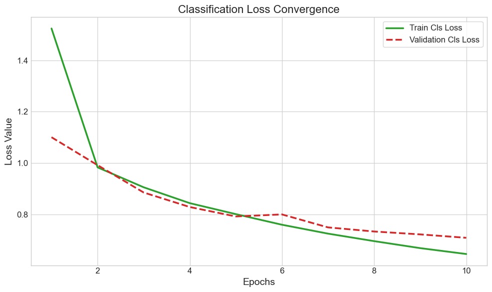
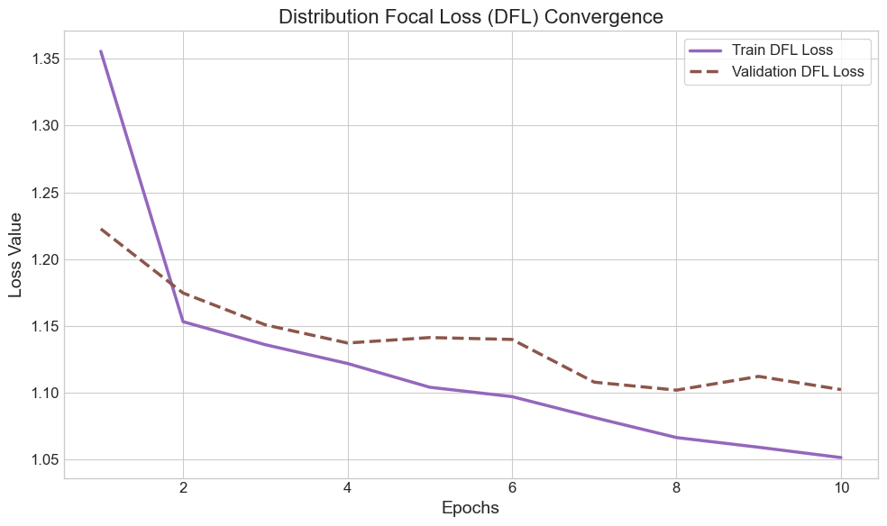
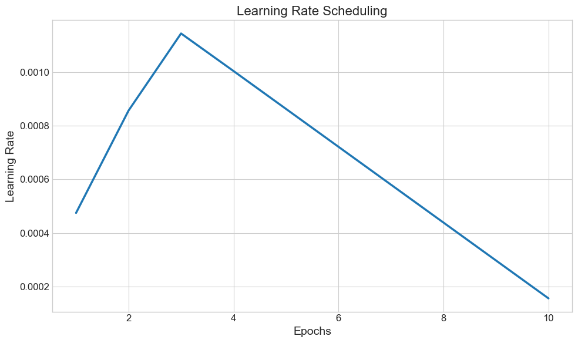
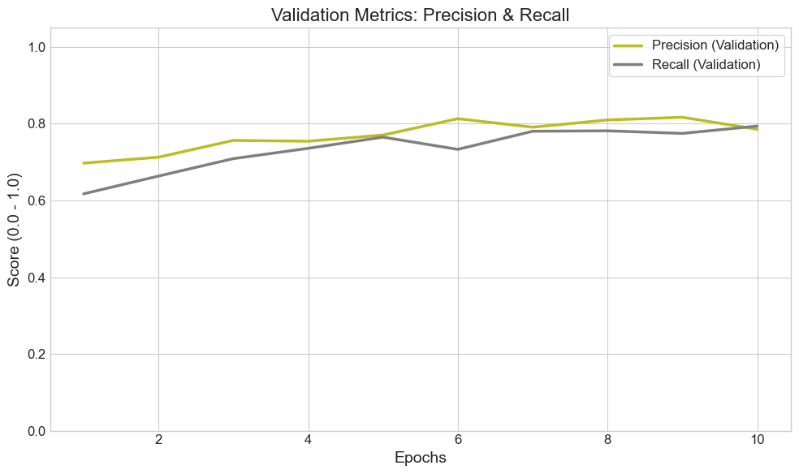
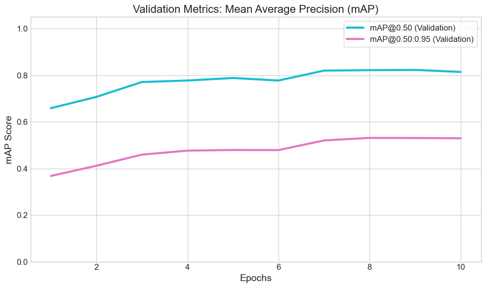
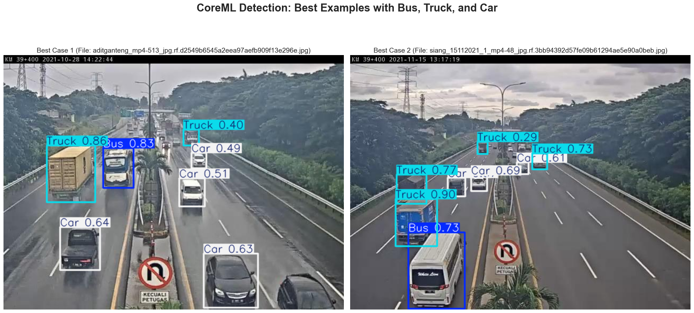

# 🚘 YOLO-Vision-Multi-Analysis-CoreML

> **YOLOv8 및 CoreML/ONNX를 활용한 다중 객체 비전 분석 및 결함 탐지 자동화 파이프라인**

> Apple Silicon(MPS) 환경에서의 모델 최적화(Finetuning)부터 Edge Device 배포를 위한 파이프라인 구축 프로젝트입니다.

---

## 🎬 Project Demo Showcase

> **CoreML 기반 경량화 모델의 실시간 다중 객체(Bus, Truck, Car) 탐지 및 고속 추적(Tracking) 시연**

  

---

## 1. Data Preprocessing

**📂 Notebook:** `checking.ipynb`

모델 학습 전, 데이터셋의 무결성을 검증하고 클래스 불균형을 해결하기 위해 라벨 전처리(Preprocessing) 파이프라인을 구축했습니다.

* **통합 매핑 규칙(Class Mapping):** 다양한 형태로 파편화된 라벨명(`big bus`, `bus-l-`, `bus-s-`, `small bus` 등)을 제조업 실무 표준 스펙에 맞춰 상위 클래스(`Bus(0)`, `Truck(1)`, `Car(2)`)로 통합 매핑 처리 및 인덱싱 재정렬.

* **데이터 무결성 검증:** `train/valid/test` 내부의 모든 txt 라벨 데이터를 전수 조사하여 Bounding Box 좌표 구조의 결함 여부 자동 스캔.

* **클래스 분포 분석:** `Counter`를 활용해 원본 데이터의 클래스별 객체 개수를 정량화하여 데이터 불균형 유무 사전 진단.

## 2. Image Size Fine-Tuning

**📂 Notebook:** `Size_finetune.ipynb`

다중 객체 탐지 장비의 하드웨어 제약 조건하고 판정 정밀도의 최적 균형을 찾기 위해 입력 해상도(`imgsz`)별 비교 실험을 수행했습니다.

* **실험 해상도 스펙:** `imgsz = [320, 480, 640, 768, 896]` 에 대한 모델 스케일링 튜닝 전개.

* **커스텀 메모리 관리 (MPS 최적화):** Apple Silicon 환경에서 연속적인 모델 튜닝(`model.tune`) 시 발생하는 공유 메모리 누수를 원천 차단하기 위해, `on_tune_epoch_end` 이벤트 시점마다 가비지 컬렉터(`gc.collect()`) 및 GPU 캐시(`torch.mps.empty_cache()`)를 강제 릴리즈하는 메모리 클린업 콜백 구현.

## 3. Epoch Fine-Tuning & Tracking

**📂 Notebook:** `Epoch_finetune.ipynb`

손실 함수 수렴을 극대화하기 위한 학습 최적화 및 고속 주행 환경에서의 객체 유실을 방지하는 추적(Tracking) 알고리즘 고도화를 진행했습니다.

* **과적합 방지 파이프라인:** Early Stopping 매커니즘과 코사인 어닐링 기반의 Learning Rate Scheduling을 결합하여 가중치 수렴 안정성 확보.

* **ByteTrack 알고리즘 가속 최적화:** 프레임 간 객체 폐색(Occlusion) 및 일시적 유실 문제를 해결하기 위해 버퍼 파라미터 튜닝.

  * `track_buffer`: 100 ➡️ **300 프레임** 확장 (일시적으로 놓친 객체의 ID 유지력을 약 10초간 대폭 향상)

  * `track_high_thresh`: 임계값 제어를 통해 노이즈로 인한 오탐(False Positive) 판정율 최소화.

## 4. Model Benchmarking & Export

**📂 Notebook:** `run.ipynb`

학습 완료된 원본 PyTorch 모델을 하드웨어 가속 엣지 디바이스 및 검사 장비 단에 임베디드하기 위한 최적화 및 벤치마킹을 수행했습니다.

* **가중치 경량화 포맷 변환:** 산업용 범용 런타임을 위한 **ONNX** 변환 파이프라인(`export_to_onnx_custom`) 구축 및 Apple Neural Engine(ANE) 하드웨어 가속을 위한 **CoreML** 포맷(`.mlpackage`) 내보내기 완료.

* **추론 벤치마크 검증:** 변환 전/후 모델의 추론 속도(Latency, FPS) 및 정밀도 수치(mAP)를 교차 검증하여 무손실 경량화 달성 여부 최종 평가.

---

## 5. Training Metrics & Visualizations

에포크 최적화 과정에서 도출된 하이퍼파라미터 수렴 및 모델 평가지표 시각화 결과입니다.

  

  

 

  

  

 

  

  

* **Loss Convergence:** Bounding Box, Classification, DFL(Distribution Focal Loss)의 Train/Val 곡선이 이격 없이 안정적으로 하향 수렴하며 이상적인 일반화 성능 달성.

* **Validation Metrics:** Precision과 Recall의 밸런스가 균형 있게 상승하였으며, 최종 mAP@0.50 지표가 최상위권에 안착하여 판정 모델로서의 높은 신뢰성 검증.

---

## 6. Final Inference Case Study

경량화 및 하드웨어 셋업이 완료된 CoreML 최적화 가중치를 활용하여 실제 테스트 셋 이미지 내 다중 객체를 바운딩 박스 단위로 판정한 결과입니다.

  

---

**👨‍💻 Author:** [본인 영문 이름 또는 깃허브 닉네임]  

**📧 Contact:** [본인 이메일 주소]
